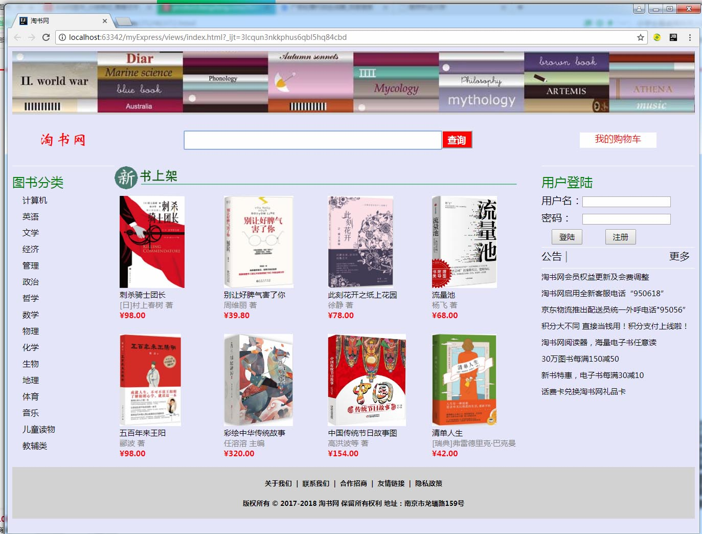
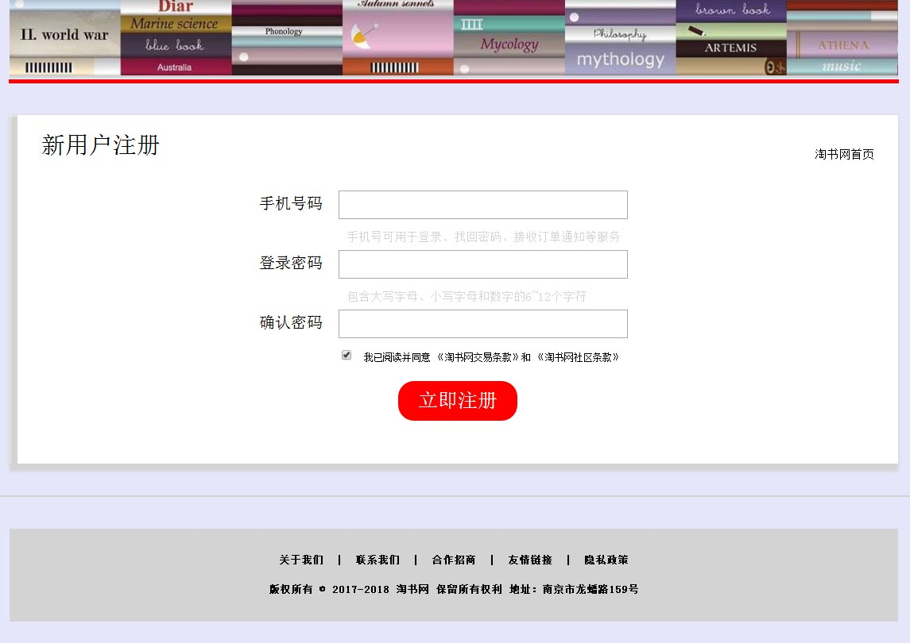
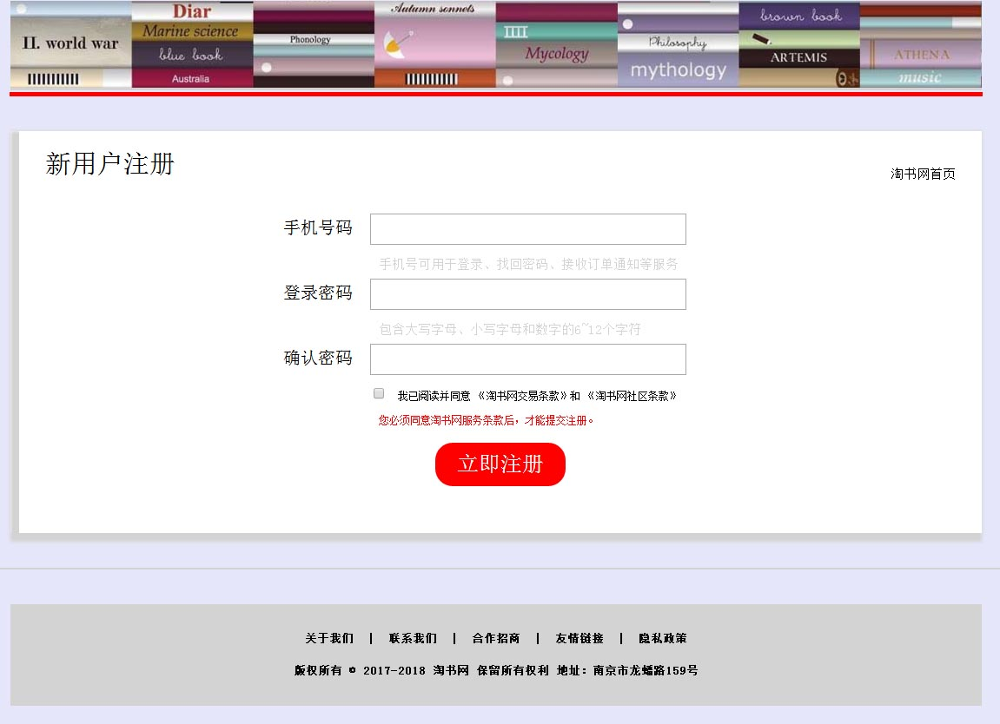
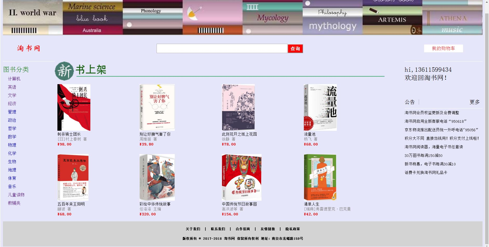
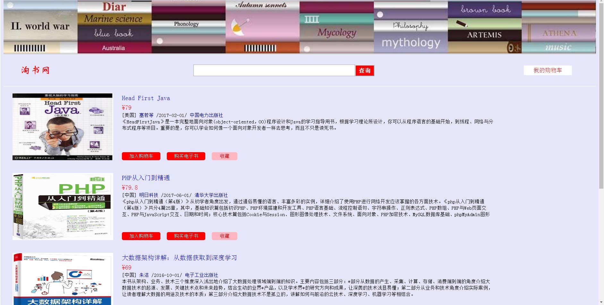
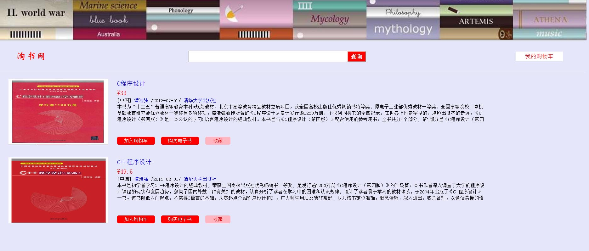
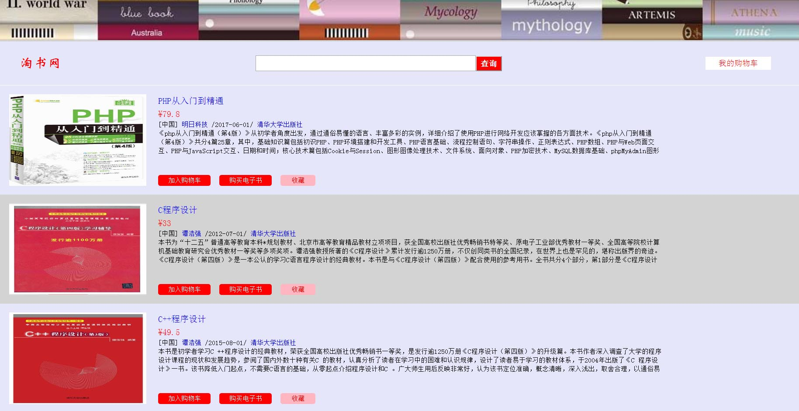
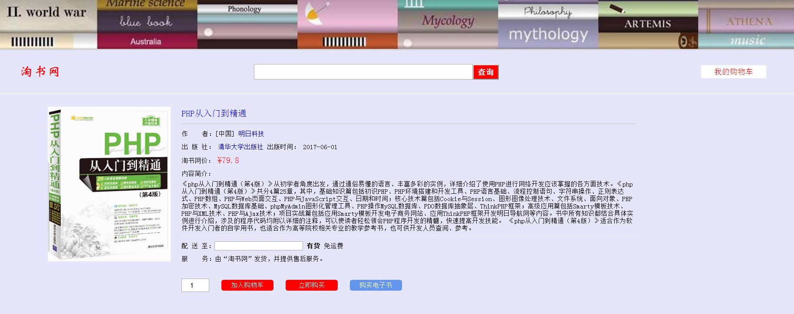
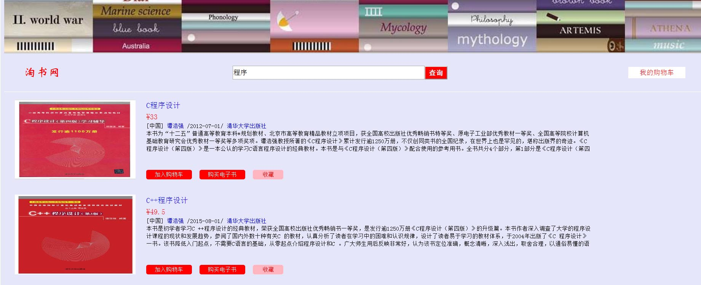
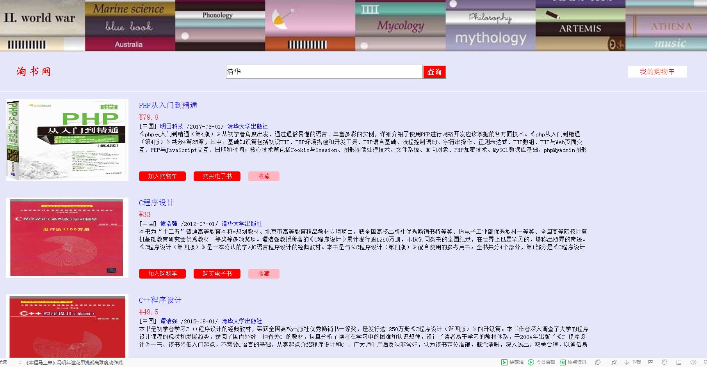

利用HTML5、CSS、MySQL设计一个淘书网，具体功能有：

# 首页

- [ ] 图中，点击"淘书网"，会打开首页；
- [x] 点击"注册"按钮，会打开注册页面，见功能2）；
- [x] 点击"登录"按钮，会启用登录功能，见功能3）；
- [ ] 点击"图书分类"下的某个类别，会启用查看不同类别书籍功能，见功能4）；
- [ ] 点击"新书上架"里的某个书名，会启用查看书籍详细信息功能，见功能5）；
- [ ] 在查询文本框中输入要查找的书籍信息，点击"查询"，会启用查询书籍功能，见功能6）。

# 注册

- [x] 单击首页上的"注册"，打开注册页面

- [x] 如果注册页面中复选框没有被选中，则会显示一段提示文字"您必须同意淘书网服务条款后，才能  提交注册。"

- [x] 图中，手机号码后的文本框只允许输入11位数字，密码必须包含大写字母、小写字母和数字，且长度为6\~12。当单击"立即注册"，会先检查用户两次输入的密码是否一致，如果一致，则将注册的手机号码和密码保存到数据库中，并且跳转到首页：

注意：此时首页的右侧不再是登录的表单，而是"hi，注册的手机号码（换行）欢迎回淘书网！"

# 登录

- [x] 当在首页上输入用户名和密码后，点击"登陆"，系统会从数据库中检查用户名和密码是否正确，如果正确，则在首页的右侧显示"hi，注册的手机号码（换行）欢迎回淘书网！"，如上图。

# 查看不同类别书籍

- [ ] 当在首页单击左侧"图书分类"中的某一类型书籍，则会从数据库中查询该类型所有的图书，并显示在网页中：

注意：此页面中书籍信息的显示是通过**循环的方式**将查询结果显示在页面上的。不能手动一行一行添加。在图中，单击"**书籍名称**"，会从数据库中查询书籍的详细信息，并显示，显示结果见功能5。

- [ ] 单击"**作者名**"，会查询该作者所有的书籍，并显示：

- [ ] 单击"**出版社**"，会查询该出版社的所有书籍，并显示；

注意：这3个页面都是使用**同一个模板**。

# 查看书籍详细信息

- [ ] 在上面的这些图中，单击"**书籍名称**"，会从数据库中查询书籍的详细信息，并显示：

图中，"书籍名称"、"作者名"和"出版社"这三个超链接显示结果如前所述。

查询数据库中该书的库存量，如果库存量不为0，则显示"**有货**"，否则显示"**无货**"。

"加入购物车"按钮前的数字文本框（input的类型为number）最大值为库存量，最小值为1。

# 查询书籍

- [ ] 每个页面都有一个产品搜索的文本框和红色的"查询"按钮，当在文本框中输入信息后，将从数据库中的书籍表中的**书名、作者名、出版社**三个字段中查询匹配输入的信息（模糊查询），并显示结果：

图中，查询文本框中填充你输入的查询字符串，例如"程序"，下面的2本书是查询出来的结果，可见这2本书中书名中都有"程序"二字。

图中，查询文本框中填充你输入的查询字符串，例如"清华"，下面的3本书是查询出来的结果，可见这3本书中出版社名中都有"清华"二字。
